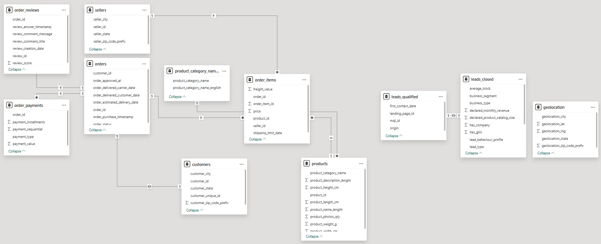

# SQL Analysis for Olist Store Sales Dataset

## Project Objective
The study project is aimed to analyze the Brazilian E-Commerce Public Dataset by Olist. The dataset contains around 100k orders during 2016 and 2018 made in different marketplaces in Brazil. It has different 
features related to multiple dimensions including order delivery status, pricing, payments, freight, customer location, product attributes etc. The project objective is to analyze the sales attribute to answer different business-related questions using basic, intermediate and advance level SQL Skills. 

## Business Queries related to sales
Generally, business team needs to know the in-depth details related to sales performance including number of orders received, shipment delivery, customer satisfaction, top product, geolocation areas, consumer analysis etc. To extract and combine these different requirements strong SQL skills are needed. In this project these skills will be exercise with the Olist schema to answer ten business related queries from basic to advance level.

## Olist Database Schema

Olist sales database comprises of different tables related to Orders,  Products, Payments, Sellers, Geographical locations, below the detailed schema showing the relationship of the tables.

## Ten Business queries
As per SQL skills these business queries are divided into Basic, Intermedia and Advance categories 

## Basic Level queries

### What are the total number of orders?

  
Click to view the output !

      - SQL Output
    

  

###  What are the total number of monthly orders?

 
### What is the breakup of order's status?

## Intermedia Level queries

### which are the top 10 sold items?
### which are the top ordering cities?
### List shipment delayed orders
### Top 10 Product categories with highest number of poor rating review?

## Advance Level queries

### what is monthly orders delivery ratio?
### What is monthly cumulative payment for whole period
### Which are the monthly top selling products for each category

## Data Visualization using Power-Bi

